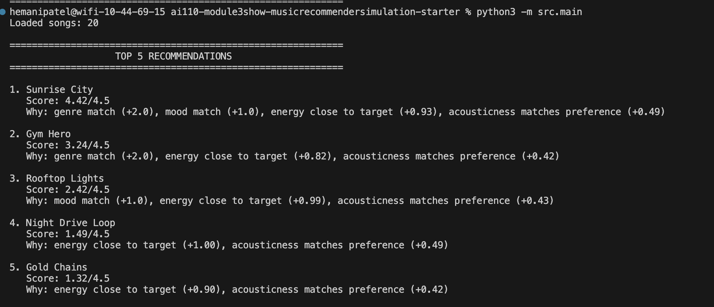
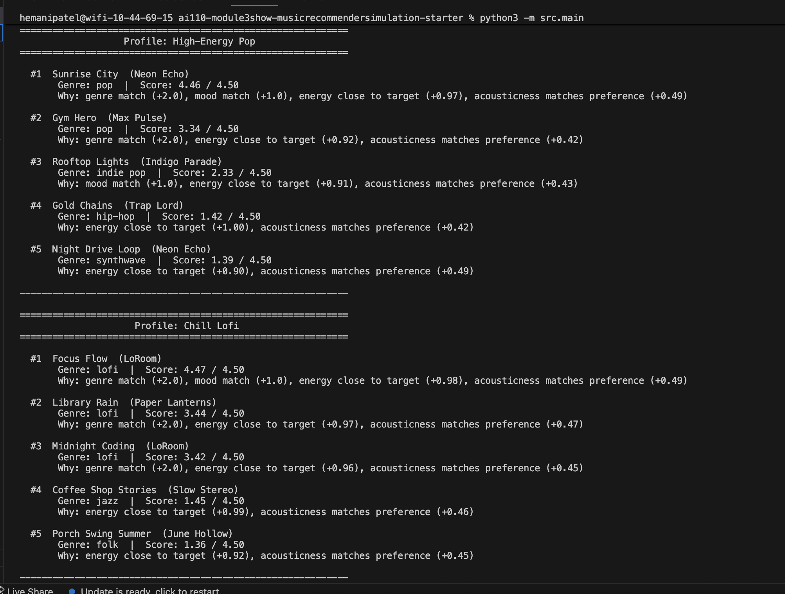
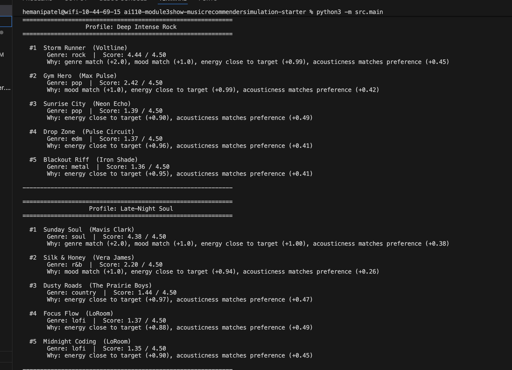
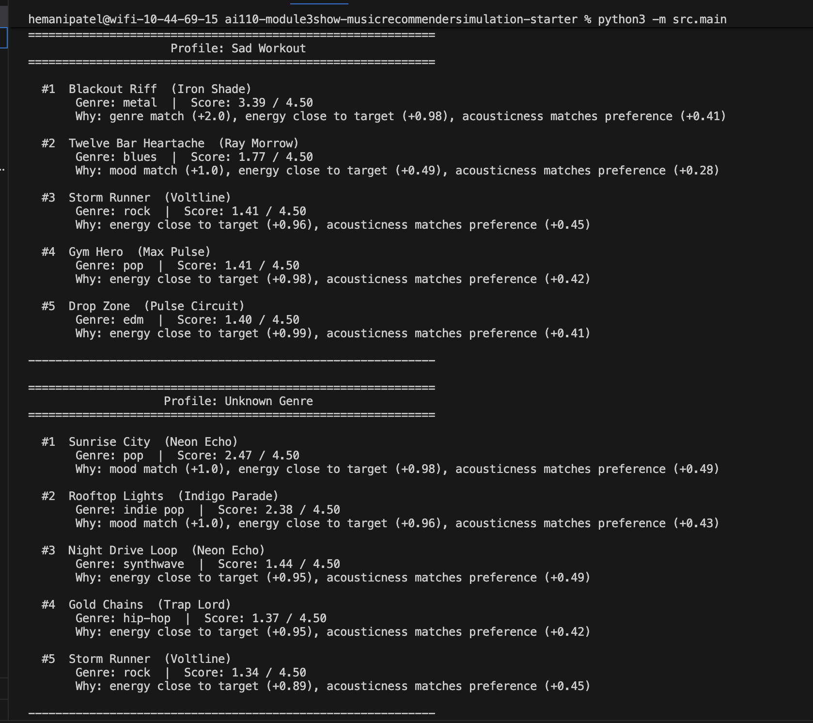
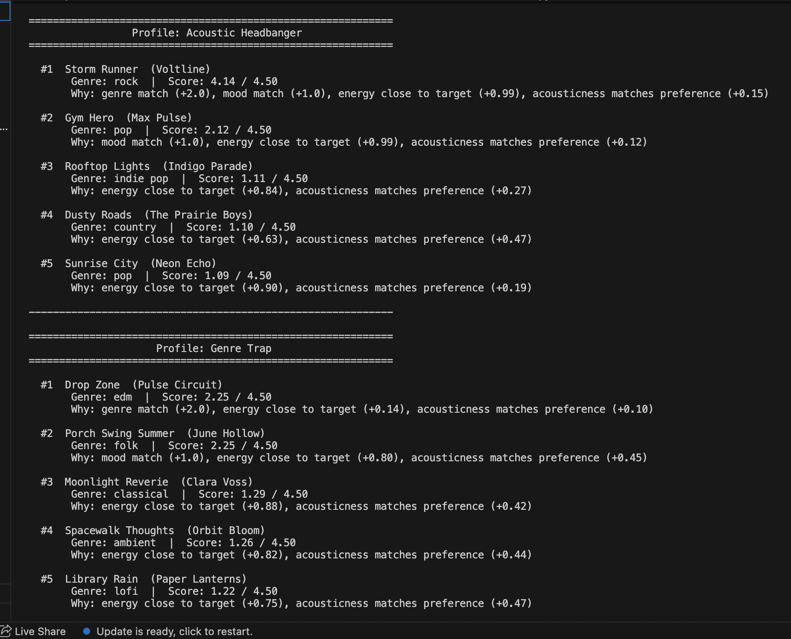

# 🎵 Music Recommender Simulation

## Project Summary

This project is a  CLI based busic recommendation system that matches songs to listener profiles using condidence labels, weighted scoring, explaination generation, and a built in reliability testing workflow. This project is an extension of the previous music reccomender simulation project into an applied AI system by adding guardrails, logging, edge case handling, and automatic evalution. 

This project matters because reccomendation systems are very common but they usually seem like black boxes that we use but don't fully understand. I wanted to build a smaller transparent version recommends songs as well as explaining why those songs were chosen and tests whether the behvaior makes sense.
---

## How The System Works

The system has 2 CLI modes: Normal and Test. The normal mode runs the recommender on listener profiles and prints top songs with scores, confidence labels, and exaplainations. The test mode runs predefined standard, edge case, and invalid profiles though the same pipeline and applied automatic checks to make sure the behvaior mathes what is expected. 

In normal mode, the system validates a listener profile, checks if the requested genre or mood exists in the catalog, then generates recommendations with scores, confidence labels, and explanations before logging the results. In test mode, the evaluator runs predefined profiles through the same recommendation pipeline, checks conditions such as genre matches, includes fallback handling, and validation failures, and prints a final pass/fial summary.

### Song Features

| Feature | Type | Role in scoring |
|---|---|---|
| `genre` | categorical | +2.0 if exact match |
| `mood` | categorical | +1.0 if exact match |
| `energy` | float 0–1 | proximity to `target_energy` → up to +1.0 |
| `acousticness` | float 0–1 | proximity to acoustic preference → up to +0.5 |
| `valence` | float 0–1 | musical positiveness (secondary signal) |
| `danceability` | float 0–1 | rhythm intensity (secondary signal) |
| `tempo_bpm` | float | speed in beats per minute (secondary signal) |

### User Profile

| Field | Type | Description |
|---|---|---|
| `genre` | string | preferred genre |
| `mood` | string | preferred mood |
| `target_energy` | float 0–1 | ideal energy level |
| `likes_acoustic` | bool | maps to acoustic target of 0.8 (True) or 0.2 (False) |

### Scoring Rule (per song)

```
score = genre match (+2.0 or 0)
      + mood match  (+1.0 or 0)
      + 1.0 × (1 − |song_energy − target_energy|)
      + 0.5 × (1 − |song_acousticness − acoustic_target|)

max possible score: 4.5
```

## Getting Started

### Setup

1. Create a virtual environment (optional but recommended):

   ```bash
   python -m venv .venv
   source .venv/bin/activate      # Mac or Linux
   .venv\Scripts\activate         # Windows

2. Install dependencies

```bash
pip install -r requirements.txt
```

3. Run the recommender:

```bash
python -m src.main
```

4. Run the reliability evaluator:

```bash
python -m src.main --test
```

### Running Tests

Run the starter tests with:

```bash
pytest
```

---

## Sample Interactions:

Example 1: High-Energy Pop Profile

Input profile

{
    "genre": "pop",
    "mood": "happy",
    "target_energy": 0.85,
    "likes_acoustic": False,
    "target_valence": 0.82,
    "target_danceability": 0.80,
}

Sample output

#1  Sunrise City
    Genre: pop  |  Score: 4.46 / 4.50  |  Confidence: High
    Why: genre match (+2.0), mood match (+1.0), energy close to target (+0.97), acousticness matches preference (+0.49)
Example 2: Chill Lofi Profile

Input profile

{
    "genre": "lofi",
    "mood": "focused",
    "target_energy": 0.38,
    "likes_acoustic": True,
    "target_valence": 0.58,
    "target_danceability": 0.60,
}

Sample output

#1  Focus Flow
    Genre: lofi  |  Score: 4.45 / 4.50  |  Confidence: High
    Why: genre match (+2.0), mood match (+1.0), energy close to target (+0.98), acousticness matches preference (+0.47)
Example 3: Unknown Genre Edge Case

Input profile

{
    "genre": "k-pop",
    "mood": "happy",
    "target_energy": 0.80,
    "likes_acoustic": False,
    "target_valence": 0.75,
    "target_danceability": 0.80,
}

Sample output

[Note] Genre 'k-pop' not found in catalog — ranking based on mood and numeric similarity only

#1  Sunrise City
    Genre: pop  |  Score: 2.47 / 4.50  |  Confidence: Low
    Why: mood match (+1.0), energy close to target (+0.98), acousticness matches preference (+0.49)


---


## Design Decisions and Trade-offs

Weighted scoring instead of a more complex model: I chose a transparent weighted scoring system instead of a more advanced machine learning model. This made the project easier to debug, explain, and evaluate, which fit the project goal of building a trustworthy applied AI system.

Confidence derived from score: I added confidence labels based on final recommendation score:

High for scores >= 4.0
Medium for scores >= 2.5
Low otherwise

This is simple, but effective enough to help users understand when the system sees a strong vs. weak match.

Fallback behavior for unsupported inputs: Instead of crashing or returning nothing when a requested genre or mood is missing from the dataset, the system falls back to numerical similarity and creates a note explaining that behavior. This increases robustness while still being honest about the system’s limitations.

Reliability-focused extension:For the final project, I chose to extend the recommender with a reliability and testing system instead of adding features like RAG or an agentic loop. This was the best fit for the existing project because it strengthened the system’s trustworthiness without implementing a completely new architecture.

---
## Testing Summary

 I added a built-in reliability evaluator to test the recommender on standard profiles, edge cases, and invalid inputs. Strong profiles like Pop / Happy, Chill Lofi, High-Energy Rock, and Relaxed Jazz consistently returned reasonable recommendations with expected genre or mood matches and at the very least Medium-confidence results, while unsupported inputs like unknown genres or moods triggered clear fallback behavior instead of crashing. Invalid profiles with missing keys or out of range values were rejected  by the validation layer. The biggest lesson I learned was that believable-looking output is not enough on its own, instead I had to add validation, logging, and explicit checks to make sure the system was actually behaving correctly.

---

## Reflection

This project taught me that building AI systems is not just about producing outputs, but about making those outputs understandable, reliable, and honest about their limits. My original music recommender worked as a prototype, but extending it into a final applied AI system pushed me to think carefully about validation, fallback behavior, logging, confidence, and evaluation. One of the biggest lessons I learned was that a reasonable looking output can still have bugs or weak logic. Thus, testing and transparency matter just as much as functionality. Overall, this project helped me see AI development as an iterative problem-solving process where technical correctness, user trust, and clear system behavior all need to work together.


---

## Reliability and Evaluation 
I tested the system in 4 different ways: automated evaluator checks, confidence scoring, logging/error handling, and manual review of sample outputs. The evaluator ran 8 standard, edge-case, and invalid-input tests through the live pipeline, and all 8 passed. Strong profiles produced sensible recommendations with Medium or High confidence, unsupported genres and moods triggered clear fallback behavior, and invalid inputs were rejected before scoring.

---

## Ethics

Limitations:
1. The song catalog is small, so recommendation quality depends heavily on limited dataset coverage.
2. Labels like genre and mood are subjective, which means the system inherits those simplifications.
3. The weighted scoring system is simple and may not capture more complex musical taste.

Possible misuse:
A user could over-trust the system and assume the recommendations are more intelligent or objective than they really are. To reduce that risk, the project includes explanation strings, fallback notes, and confidence labels instead of pretending every result is equally strong.

What surprised me during testing:
One surprising lesson was how easy it is for a system to look correct while still being subtly wrong. Early scoring bugs produced recommendation explanations with impossible numeric values, which made it clear that a reasonable looking output is not enough without actual evaluation.

Collaboration with AI:
AI-assisted coding tools helped me move faster, but they were not always right.

One helpful suggestion was using a clearer CLI structure for two modes:

normal recommendation mode
--test evaluator mode

That made the project easier to run and explain.

One flawed suggestion was an earlier change that renamed keys like genre and mood to favorite_genre and favorite_mood, which broke consistency with the scoring logic. Catching and fixing that mismatch reinforced the importance of checking AI-generated code carefully rather than just automatically trusting it.
---

## 2. Intended Use

- What is this system trying to do
- Who is it for

Example:

> This model suggests 3 to 5 songs from a small catalog based on a user's preferred genre, mood, and energy level. It is for classroom exploration only, not for real users.

---

## 3. How It Works (Short Explanation)

Describe your scoring logic in plain language.

- What features of each song does it consider
- What information about the user does it use
- How does it turn those into a number

Try to avoid code in this section, treat it like an explanation to a non programmer.

---

## 4. Data

Describe your dataset.

- How many songs are in `data/songs.csv`
- Did you add or remove any songs
- What kinds of genres or moods are represented
- Whose taste does this data mostly reflect

---

## 5. Strengths

Where does your recommender work well

You can think about:
- Situations where the top results "felt right"
- Particular user profiles it served well
- Simplicity or transparency benefits

---

## 6. Limitations and Bias

Where does your recommender struggle

Some prompts:
- Does it ignore some genres or moods
- Does it treat all users as if they have the same taste shape
- Is it biased toward high energy or one genre by default
- How could this be unfair if used in a real product

---

## 7. Evaluation

How did you check your system

Examples:
- You tried multiple user profiles and wrote down whether the results matched your expectations
- You compared your simulation to what a real app like Spotify or YouTube tends to recommend
- You wrote tests for your scoring logic

You do not need a numeric metric, but if you used one, explain what it measures.

---

## 8. Future Work

If you had more time, how would you improve this recommender

Examples:

- Add support for multiple users and "group vibe" recommendations
- Balance diversity of songs instead of always picking the closest match
- Use more features, like tempo ranges or lyric themes

---

## 9. Personal Reflection

A few sentences about what you learned:

- What surprised you about how your system behaved
- How did building this change how you think about real music recommenders
- Where do you think human judgment still matters, even if the model seems "smart"

## Recommendation Output



### High-Energy Pop / Chill Lofi


### Deep Intense Rock / Late-Night Soul


### Sad Workout / Unknown Genre


### Acoustic Headbanger / Genre Trap

