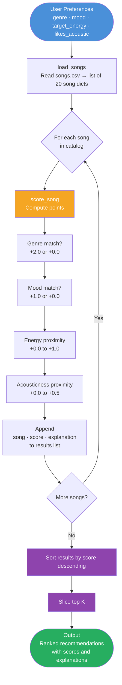

# Music Recommender — Data Flow

## Stage legend

| Color | Stage | Code location |
|---|---|---|
| Blue | User input | `main.py` — `user_prefs` dict |
| Orange | Score one song | `recommender.py` — `score_song()` |
| Purple | Sort and slice | `recommender.py` — `recommend_songs()` |
| Green | Final output | `main.py` — `main()` print loop |
